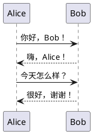
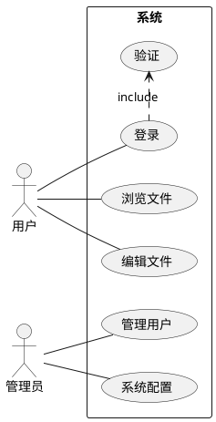
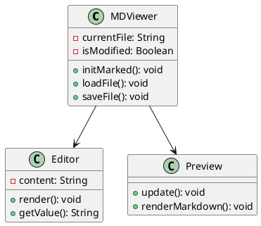
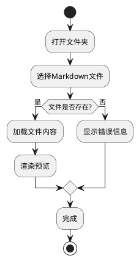
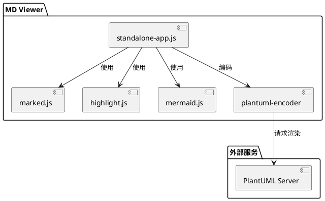
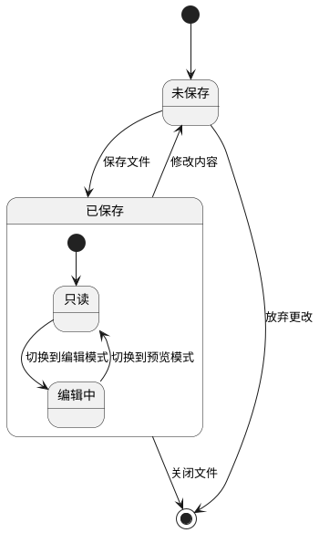
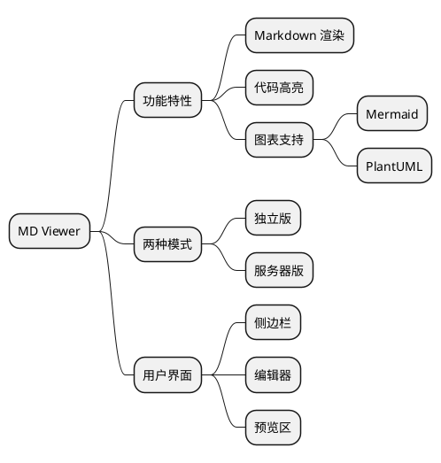
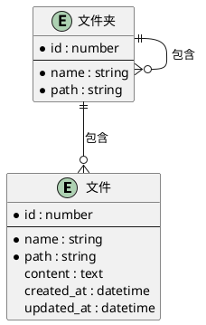
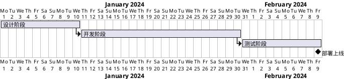

# PlantUML 使用指南

MD Viewer 现在支持 PlantUML 图表渲染！PlantUML 是一个强大的 UML 图表绘制工具，支持多种图表类型。

## 基本用法

在 Markdown 中使用 PlantUML，只需将代码放入 ` ```plantuml ` 或 ` ```puml ` 代码块中：

## 时序图 (Sequence Diagram)



## 用例图 (Use Case Diagram)



## 类图 (Class Diagram)



## 活动图 (Activity Diagram)



## 组件图 (Component Diagram)



## 状态图 (State Diagram)



## 思维导图 (Mind Map)



## ER 图 (Entity Relationship)



## 甘特图 (Gantt Chart)



## 注意事项

1. **网络需求**: PlantUML 图表通过 `plantuml.com` 在线服务器渲染，需要网络连接
2. **代码标记**: 可以使用 `plantuml` 或 `puml` 作为代码块语言标记
3. **起止标签**: 推荐在代码中包含 `@startuml` 和 `@enduml` 标签
4. **主题支持**: 可以使用 `skinparam` 命令自定义图表样式
5. **中文支持**: PlantUML 完全支持中文字符

## 与 Mermaid 的对比

| 特性 | PlantUML | Mermaid |
|------|----------|---------|
| 渲染方式 | 服务器端 | 客户端 |
| 图表类型 | 更丰富 | 常用类型 |
| 离线使用 | 需要本地服务器 | 可以 |
| 语法复杂度 | 较复杂 | 较简单 |
| 扩展性 | 更强 | 有限 |

## 更多资源

- [PlantUML 官网](https://plantuml.com/)
- [PlantUML 语法参考](https://plantuml.com/zh/)
- [在线编辑器](https://www.plantuml.com/plantuml/uml/)
