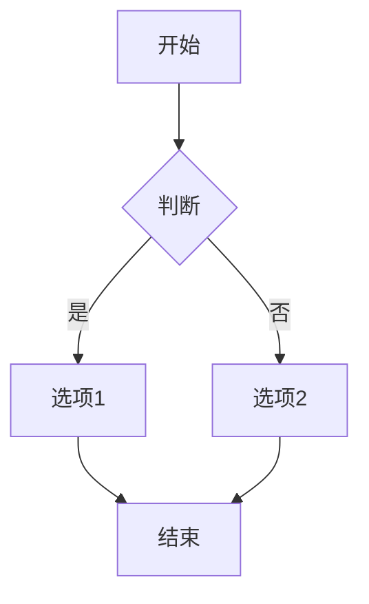
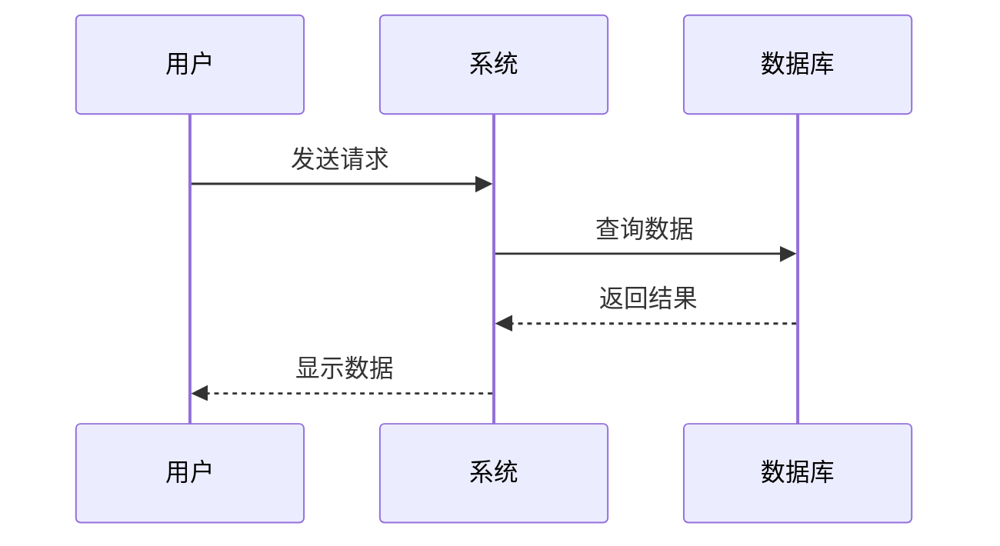
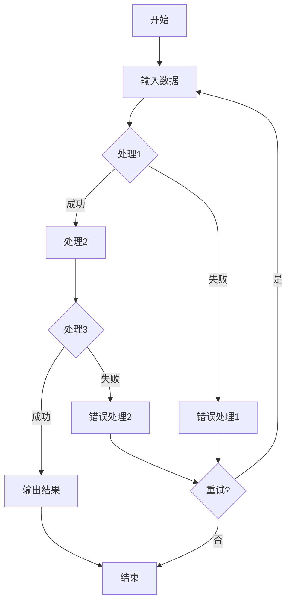

# Mermaid 图表测试

本文档用于测试 PNG 下载和初始显示大小修复。

## 小型流程图

这是一个简单的小流程图，应该以自然大小显示：

## 中等流程图

这是一个中等大小的流程图：

## 序列图

测试序列图的显示效果：

## 复杂流程图

测试较复杂的流程图：

## 测试说明

双击任意图表可以打开缩放模态框，然后：
1. 点击 PNG 按钮测试 PNG 下载功能
2. 观察图表初始显示大小是否合适
