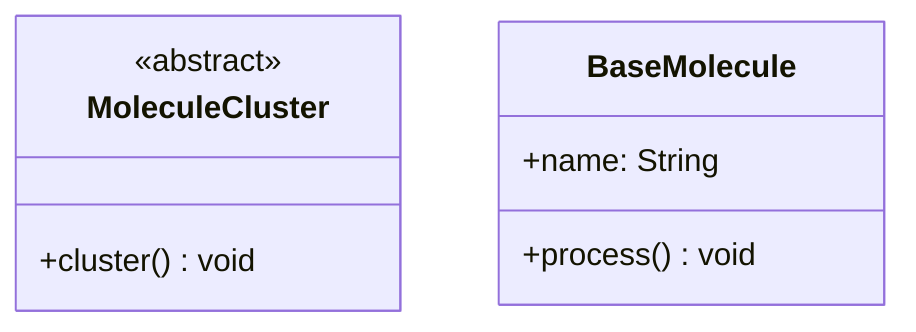
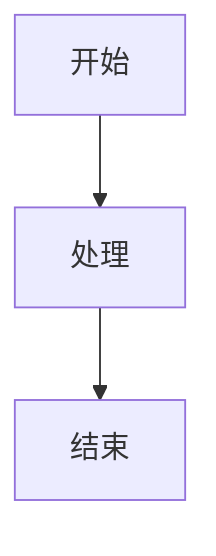
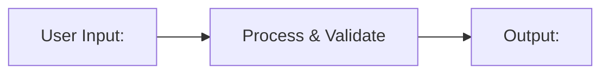
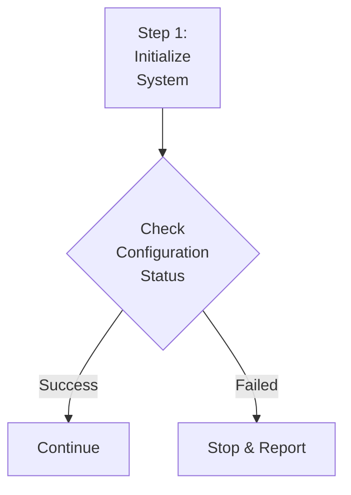

# Mermaid 语法错误修复测试

## 测试 1: HTML 标签字符（常见错误）

这个测试包含 `<abstract>` 标签，在旧版本会导致 "Syntax error in text" 错误。

## 测试 2: 零宽字符和特殊空格

**说明**：下面的文本中，"开始"、"处理"、"结束" 后面包含了不可见的零宽字符 (U+200B)。
这些字符在正常编辑器中无法看到，但会导致 Mermaid 解析错误。预处理器会自动移除它们。

**如何验证**：在文本编辑器中，光标在这些文字后面会有额外的停顿位置。

## 测试 3: 特殊字符在标签中

## 测试 4: 多行文本和特殊字符

## 预期结果

所有图表应该正常显示，不应出现 "Syntax error in text mermaid version 11.12.2" 错误。
