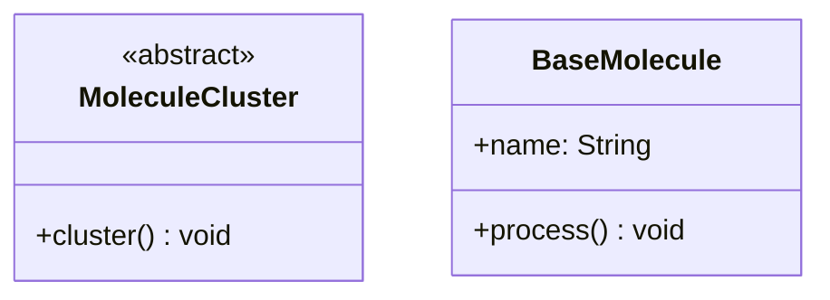
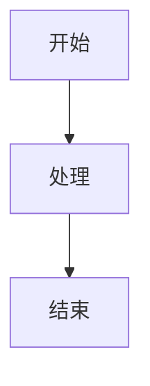
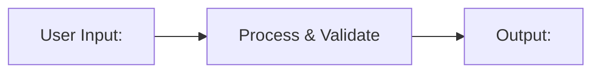
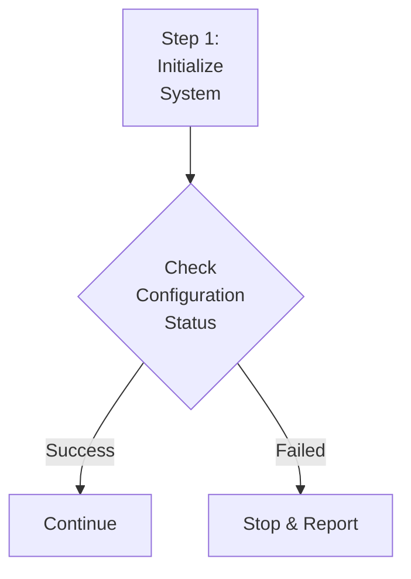

# Mermaid 语法错误修复测试

## 测试 1: HTML 标签字符（常见错误）

这个测试包含 `<abstract>` 标签，在旧版本会导致 "Syntax error in text" 错误。

## 测试 2: 零宽字符和特殊空格

## 测试 3: 特殊字符在标签中

## 测试 4: 多行文本和特殊字符

## 预期结果

所有图表应该正常显示，不应出现 "Syntax error in text mermaid version 10.6.1" 错误。
