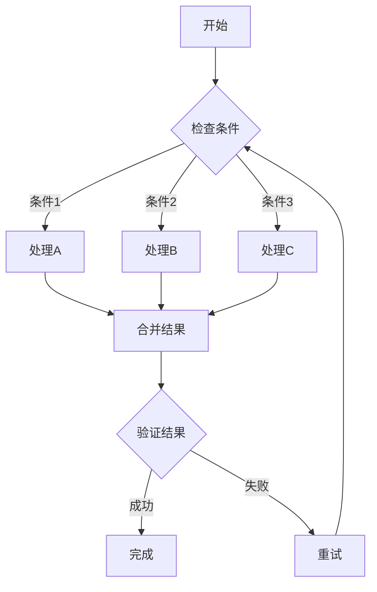
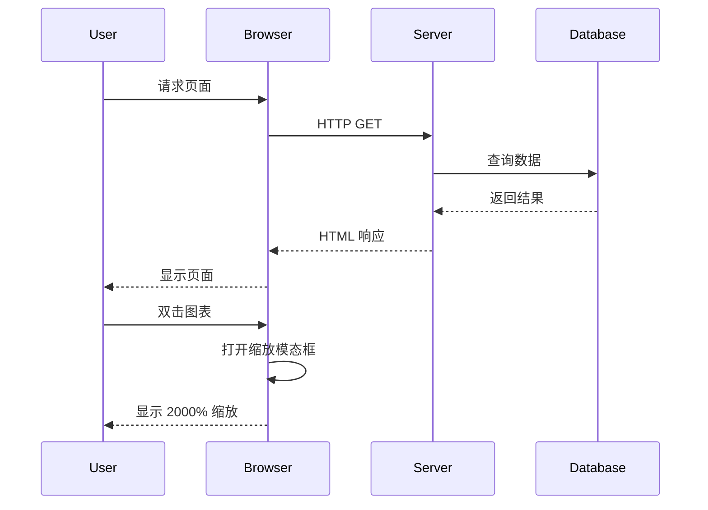

# Zoom Test - 缩放测试

This file is for testing the new 2000% zoom capability.

## Mermaid Diagram - Flow Chart

## Mermaid Diagram - Sequence Diagram

## Test Instructions - 测试说明

1. 双击上面的任意一个图表
2. 在弹出的缩放模态框中，使用 "+" 按钮多次点击
3. 验证缩放级别可以达到 2000%
4. 使用鼠标滚轮也可以缩放
5. 使用键盘快捷键 "+" 和 "-" 进行缩放
6. 按 "0" 重置缩放

Expected behavior:
- 缩放应该可以从 50% 放大到 2000%
- 在高缩放级别下，可以拖动图表进行平移
- 图表应该保持清晰度（SVG 格式）
